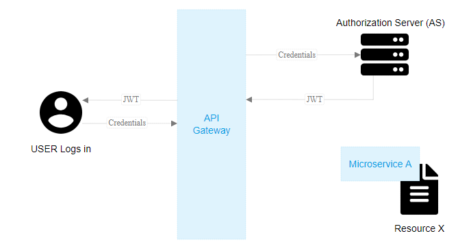
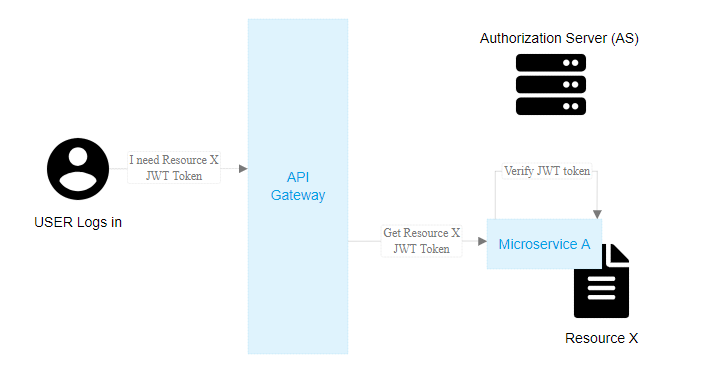
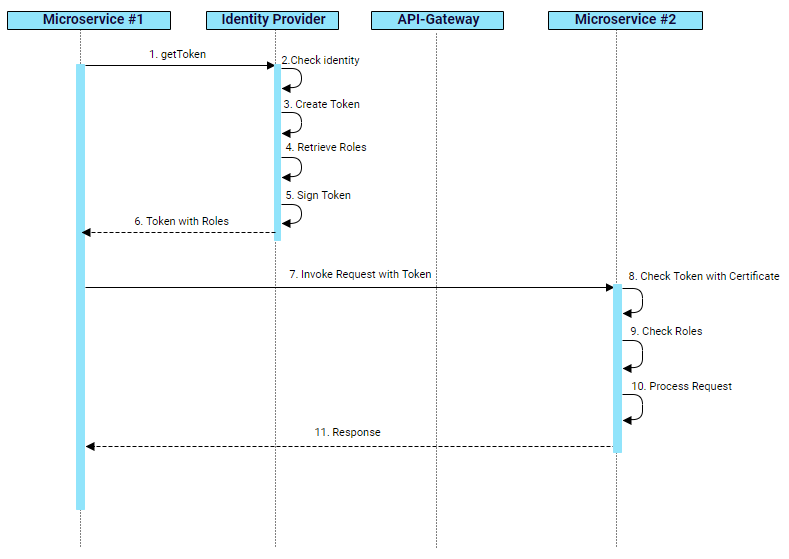

# Microservices Security

While designing microservices, a big monolithic application is broken down into smaller services that can be independently developed and deployed. The final application will have more HTTP calls than a single monolithic application, how can we protect these calls between services?

While a **microservices architecture** makes building software easier, managing the security of microservices has become a challenge. Managing the security of the traditional monolithic applications is quite different than managing the security of a microservices application. For example, in the monolithic application, it is easy to implement a centralized security module that manages authentication, authorization, and other security operations; with the distributed nature of microservices, having a centralized security module could impact efficiency and defeat the main purpose of the architecture. The same issues hold true for data sharing: monolithic applications share data between the different modules of the app “in-memory” or in a “centralized database,” which is a challenge with the distributed microservices. 

## Requirement

Different organizations have different security requirement. When designing the security architecture of the microservices platform, we have to make sure that it is suitable for all types of organizations. In most of the cases, security is a tradeoff between performance and risk. If you build a blog application, you want it to be as fast as possible with adequate security. If you are building a banking application, you want it to be as secure as possible. So we cannot have one security design for all customers. We need to have multi-tier of security ranged from low, medium and high.

Beside above requirements, we need to ensure that interactions to the OAuth 2.0 provider is minium so that we can save network trips. Another requirement is to follow OAuth 2.0 flow as much as possible. Only extend it if absolute possible.  

## Use Cases 

#### Traditional Web Service
Traditional Web Service is flattened and typically only used within the internal network. If it is exposed to the internet, an API gateway is used for security. As this is the use case addressed in the OAuth 2.0 specification, authorization code or client credentials flow are used with only one access token in the Authorization header.
#### Microservice to Microservice
When a original client calling the first microservice, it only pass one token in the Authorization header. That token can be authorization code token or client credientials token. When the first microservice calls another one, the original token is still passed in Authorization header to the next service; however, the orginal token won’t have the right scope.
#### Standalone App to Microservices
Standalone application like desktop application or batch job might not have a specific user info but it need to access API or services to fulfill its task. In this case, the client credentials grant type will be followed.
#### Single Page App to Microservices
Single-page apps (or browser-based apps) run entirely in the browser after loading the Javascript and HTML source code from a web page. Since the entire source is available to the browser, they cannot maintain the confidentiality of a client secret, so the secret is not used for these apps. The flow is exactly the same as the authorization code flow, but at the last step, the authorization code is exchanged for an access token without using the client secret.
#### Native Mobile App to Microservices
Like browser-based apps, mobile apps also cannot maintain the confidentiality of a client secret. Because of this, mobile apps must also use an OAuth flow that does not require a client secret.
**PKCE**:  Proof Key for Code Exchange (PKCE) is a security extension to OAuth 2.0 for public clients on mobile devices that is designed to prevent interception of the authorization code by any malicious application on the same device.

## Securing Microservices: The API gateway, authentication and authorization

### The API Gateway  
Probably the most obvious approach to communicating with microservices from the external world is having an API Gateway.  
The API Gateway is the entry point to all the services that your application is providing. It’s responsible for service discovery (from the client side), routing the requests coming from external callers to the right microservices, and fanning out to different microservices if different capabilities were requested by an external caller (imagine a web page with dashboards delivered by different microservices). If you take a deeper look at the API Gateways, you’ll find them to be a manifestation of the famous façade design pattern. 

From the security point of view, API Gateways usually handle the authentication and authorization from the external callers to the microservice level. 
**OAuth delegated authorization** along with **JSON Web Tokens (JWT)** is the most **efficient and scalable** solution for authentication and authorization for microservices.

To illustrate further, a user starts by sending his credentials to the API gateway which will forward the credentials to the Authorization Server (AS) or the OAuth Server. The AS will generate a JASON Web Token (JWT) and will return it back to the user.  

Whenever the user wants to access a certain resource, he’ll request it from the API Gateway and will send the **JWT** along with his request. 
The **API Gateway** will forward the request with the JWT to the microservice that owns this resource. 
The **microservice** will then decide to either grant the user the resource (if the user has the required permissions) or not. Based on the implementation, the microservice can make this decision by itself (if it knows the permissions of this user over this resource) or simply forward the request to one of the Authorization Servers within the environment to determine the user’s permissions.

The approach above is much more scalable than the traditional centralized session management. It allows every individual microservice to handle the security of its own resources. If a centralized decision is needed, the OAuth server is there to share permissions with the different microservices.

A challenge with this approach will be if you want to **revoke** the permissions of the user before the expiration time of the **JWT**.

The microservices are distributed, possibly in several locations around the world, and the API Gateway is just forwarding the requests to the responsible microservice.  That means that revoking the permissions requires communicating with every single microservice, which is not very practical. If this was a critical feature, then the API Gateway can play a pivotal role by sending a reference of the JWT to the user instead of the JWT value itself. Each time the user requests a resource from the API Gateway, the API Gateway will convert the reference to the JWT value and forward it as normal. If revoking the permissions is needed, then only a single request to the API Gateway will be provided, then the API Gateway can kill the session for that user. This solution is less “distributed” than the JWT value so it’s up to the Software Architect and the application requirements to follow either approach.

### Auth Sequence: Microservice-to-Microservice  
 

### Auth Sequence: Frontend-to-Microservice  

OAuth 2.0 is the de facto standard for API security, and we are following it as close as possible. However, OAuth 2.0 was written for web services, not Microservices and there is no coverage for service to service invocation. The solution is to add more functionalities when OAuth 2.0 is not enough. 

### Distributed JWT Verification 

Let’s assume the following:

Client is a web server, and it has client as client_id.
* API A is a microservice, and it has apia as client_id, and it requires a.r scope to access.
* API B is a microservice, and it has apib as client_id, and it requires b.r scope to access.
* API C is a microservice, and it has apic as client_id, and it requires c.r scope to access.
* API D is a microservice, and it has apid as client_id, and it requires d.r scope to access.

#### User triggers the authentication

When a user clicks the login button or accesses a resource that is protected, he will be redirected to OAuth 2.0 server to authenticate. After providing username and password, an authorization code is redirected back to the browser. The client will handle the redirect url and get the authorization code. By sending client as client_id, client_secret and authorization code from user to OAuth server, Client gets a JWT token with

* user_id = user
* client_id = client
* scope = \[a.r\]

This token will be put into the Authorization header of the request to API A. When API A receives the request, it verifies the JWT token with the public key issued by OAuth server . If the signature verification is successful, it will verify the scope in the token against the OpenAPI specification defined for the endpoint Client1 is accessing. As a.r is required and it is in the JWT scope, it allows the access.

#### API A calls API B and API C

Now API A needs to call API B and API C to fulfill the request. As this is API to API call or service to service call, there is no user id involved and Client Credentials flow will be used here to get another JWT token to access B and C. The original JWT token doesn’t have the scopes to access B and C as Client1 does not even care A is calling B and C. So here API A needs to get a token associated with client_id apia which has proper scope to access API B and API C.This token will have the following claims.

* client_id = apia
* scope = \[b.r c.r\]

As the original token has the original user_id or custom claims, it is carried in the entire service to service calls in the Authorization header so that each service has a chance to do fine-grained (role-based or user-based) authorization if it is necessary. The new client_credentials token will be passed in the request header “X-Scope-Token” for scope verification against OpenAPI specification on API B and API C.

#### API B and API C token verification

The token verification on API B and API C are the same. So let’s use API B as an example to explain the verification process.When API B receives the request, it first checks the Authorization token to make sure it is valid with signature verification. Then if scope verification is enabled, it checks if ‘X-Scope-Token’ header exists. If yes, it will verify its signature and match the scopes with endpoint defined scopes in the specification. If scope matching is failed, it will fall back to Authorization token to see if it has the scopes required. If none of the tokens has the scopes required, an error will be sent back to the caller.

#### API B calls API D

The process is very similar to API A calls API B and API C. A client credentials token will be retrieved by API B from OAuth server, and it has the following claims.

* client_id = apib
* scope = \[d.r]

### Token Exchange and Token Chaining

As described above, there are two tokens involved for service to service invocation and this pattern should cover most of the security requirement. However, there are certain cases that verify only the immediate caller is not enough. For example, the payment service needs to know that the request is initiated from the shopping cart and go through the order service. This cannot be done with the above two token pattern. In order to verify the call stack, the access/scope token must be chained so that the entire call stack can be verified by any token in the chain.OAuth 2.0 has a draft specification called [token exchange](https://tools.ietf.org/html/draft-ietf-oauth-token-exchange-12) and it can be utilized to embed previous token client id in the current token client id. In this case, when service goes to OAuth server to get the token, it must pass the access token it has received to the OAuth server so that the client id can be chained together in the new token. When the target service receives the token, it can verify the call stack in the token against its configuration to decide if access can be granted. 